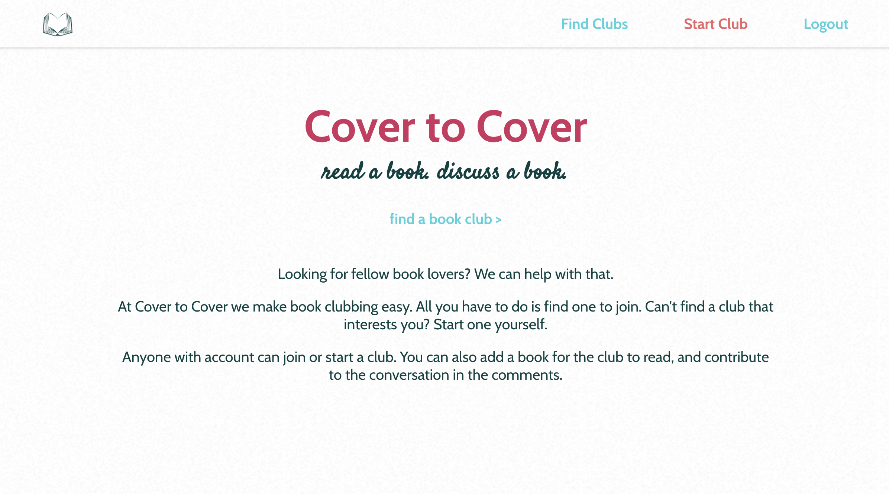
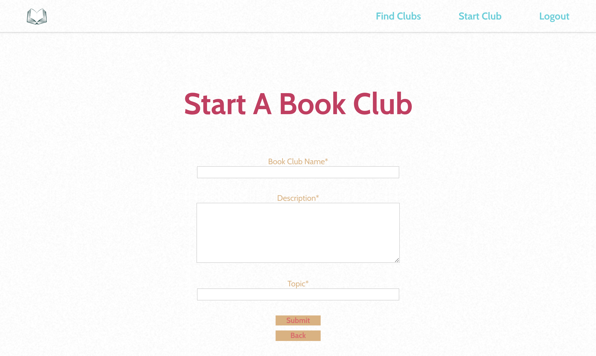
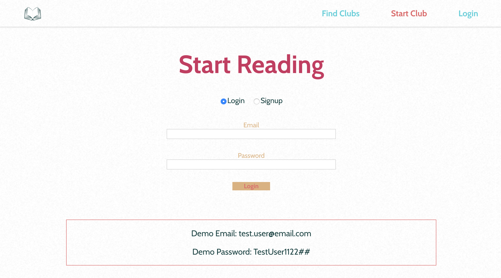

# Cover To Cover App

A virtual book club application. Users can create an account, find clubs to join, add books for the group to read, comment on the books and start their own club.

## Motivation

Book clubs are a great way to meet new people and be exposed to new things and ideas. I wanted to provide a space where anyone can read books together and discuss them.

## Screenshots
Home Screen:



Club List:


Individual Club:


Add Club:



Login:



## Running Tests

To run tests, run
```
npm test
```

## Built With

### Front-End
* React
* React-Router

### Testing
* Jest

## Features

* Create a club
* Comment on clubs
* Update clubs
* See every club currently available

## Demo

- [Live Demo](https://cover-to-cover-app.legsateri.now.sh/)

## Server

- [Server Repo](https://github.com/legsateri/cover-to-cover-api)